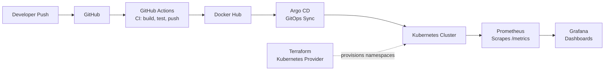

# 🚀 CommerceOps Platform

A Kubernetes DevOps Platform, built in Go, with a complete production-style delivery pipeline wrapped around it: **CI → containerization → GitOps deployment → Kubernetes orchestration → infrastructure as code → monitoring**.


---

## Overview

CommerceOps Platform is a small Go web service that I used as a vehicle to build and operate a **real, end-to-end DevOps pipeline** — not just a deployed app, but everything around it: automated builds, GitOps-driven releases, infrastructure as code, and observability with real metrics flowing through Prometheus and Grafana.

The app itself exposes a `/health` endpoint, a Prometheus `/metrics` endpoint with a custom counter, and a homepage that doubles as a live status dashboard for the whole platform.

**What this project demonstrates:**
- A full CI → CD pipeline triggered on every push, with GitHub Actions building and publishing a Docker image
- GitOps deployment via Argo CD — the cluster state is reconciled from Git, not from manual `kubectl apply`
- Kubernetes workloads packaged and templated with Helm rather than raw YAML
- Infrastructure as Code using Terraform's Kubernetes provider for Kubernetes namespace provisioning and resource management
- Custom application metrics instrumented directly in Go and scraped by Prometheus via a `ServiceMonitor`
- Multi-stage Docker builds (`golang:1.26` build stage → `alpine` runtime) to keep the final image small

---

## Architecture



Terraform provisions Kubernetes resources using Infrastructure as Code principles while application delivery is handled through GitOps workflows.
---

## Tech Stack

| Layer               | Tool                        | Purpose                                          |
|---------------------|------------------------------|---------------------------------------------------|
| Application          | Go 1.26                     | HTTP server, custom Prometheus instrumentation     |
| Containerization     | Docker (multi-stage build)  | Small, reproducible runtime image                  |
| CI                   | GitHub Actions              | Build, test, and publish on every push             |
| Image Registry       | Docker Hub                  | Stores versioned application images                |
| Infrastructure as Code | Terraform (Kubernetes provider) | Provisions Kubernetes-level resources (namespaces) |
| Orchestration        | Kubernetes                  | Runs and manages the application and monitoring stack |
| Package Management   | Helm                        | Templated, versioned Kubernetes deployments         |
| GitOps / CD          | Argo CD                     | Continuous, Git-driven deployment to the cluster    |
| Monitoring           | Prometheus + kube-prometheus-stack | Scrapes app and cluster metrics              |
| Visualization        | Grafana                     | Dashboards for HTTP traffic, Go runtime, system resources |

---

## Pipeline Walkthrough

### 1. Live Dashboard

The homepage provides a visual dashboard displaying the technologies used in the platform and links to `health` and `metrics` endpoints.


### 2. Continuous Integration — GitHub Actions

Every push to `main` triggers the **Go CI Pipeline**, which builds the Go binary, builds the Docker image, and publishes it. All recent runs are green.


### 3. Image Registry — Docker Hub

The CI pipeline publishes versioned images to Docker Hub, which Argo CD/Kubernetes then pull from.


### 4. GitOps Deployment — Argo CD

Argo CD continuously reconciles the cluster against the `helm/ecommerce-app` path in this repo. No manual `kubectl apply` for deployments — Git is the source of truth.


### 5. Kubernetes Orchestration

The application and the entire `kube-prometheus-stack` monitoring stack run as pods in the cluster, exposed via Services.


### 6. Package Management — Helm

The app is deployed as a Helm release (not raw manifests), versioned and upgradeable.


### 7. Observability — Prometheus & Grafana

A `ServiceMonitor` tells Prometheus to scrape the app's `/metrics` endpoint every 15 seconds. The custom `http_requests_total` counter — incremented on every real request — flows from the Go app, through Prometheus, into a Grafana dashboard.


---

## Project Structure

```
ecommerce-devops-platform/
├── .github/
│   └── workflows/              # CI pipeline (build, test, push image)
├── app/                        # Go application source
│   ├── Dockerfile
│   ├── go.mod / go.sum
│   └── main.go
├── helm/
│   └── ecommerce-app/          # Helm chart for the app
│       ├── Chart.yaml
│       ├── values.yaml
│       └── templates/
├── kubernetes/                 # Plain K8s manifests
│   ├── deployment.yaml
│   └── service.yaml
├── monitoring/
│   └── servicemonitor.yaml     # Tells Prometheus what & how often to scrape
├── terraform/
│   └── k8s/                 # Terraform (Kubernetes provider) — namespace provisioning
└── README.md
```

---

## Key Configuration

**`app/Dockerfile`** — multi-stage build to keep the runtime image small:

```dockerfile
# Build Stage
FROM golang:1.26 AS builder

WORKDIR /app

COPY go.mod .
COPY go.sum .

RUN go mod download

COPY . .

RUN CGO_ENABLED=0 GOOS=linux go build -a -installsuffix cgo -o ecommerce-app

# Runtime Stage
FROM alpine:latest

WORKDIR /root/

COPY --from=builder /app/ecommerce-app .

EXPOSE 8080

CMD ["./ecommerce-app"]
```

**`app/main.go`** — custom Prometheus counter wired into the handlers:

```go
var httpRequestsTotal = prometheus.NewCounter(
    prometheus.CounterOpts{
        Name: "http_requests_total",
        Help: "Total number of HTTP requests",
    },
)

func main() {
    prometheus.MustRegister(httpRequestsTotal)

    http.HandleFunc("/", homeHandler)
    http.HandleFunc("/health", healthHandler)
    http.Handle("/metrics", promhttp.Handler())

    http.ListenAndServe(":8080", nil)
}
```

**`kubernetes/deployment.yaml`**

```yaml
apiVersion: apps/v1
kind: Deployment
metadata:
  name: ecommerce-app
spec:
  replicas: 1
  selector:
    matchLabels:
      app: ecommerce-app
  template:
    metadata:
      labels:
        app: ecommerce-app
    spec:
      containers:
        - name: ecommerce-app
          image: ecommerce-app:v1
          ports:
            - containerPort: 8080
```

**`kubernetes/service.yaml`**

```yaml
apiVersion: v1
kind: Service
metadata:
  name: ecommerce-service
spec:
  selector:
    app: ecommerce-app
  ports:
    - protocol: TCP
      port: 80
      targetPort: 8080
  type: NodePort
```

**`helm/ecommerce-app/values.yaml`**

```yaml
replicaCount: 1

image:
  repository: tharunm11/ecommerce-app
  tag: latest
  pullPolicy: Always

service:
  type: NodePort
  port: 80
  targetPort: 8080

autoscaling:
  enabled: false

serviceAccount:
  create: false
```

**`monitoring/servicemonitor.yaml`**

```yaml
apiVersion: monitoring.coreos.com/v1
kind: ServiceMonitor
metadata:
  name: ecommerce-app
  labels:
    release: monitoring
spec:
  selector:
    matchLabels:
      app.kubernetes.io/name: ecommerce-app
  endpoints:
    - port: http
      path: /metrics
      interval: 15s
```

---

## Getting Started

### Run locally

```bash
cd app
go mod download
go run main.go
# App available at http://localhost:8080
# Metrics at http://localhost:8080/metrics
```

### Run with Docker

```bash
cd app
docker build -t ecommerce-app:local .
docker run -p 8080:8080 ecommerce-app:local
```

### Deploy to Kubernetes

```bash
# Provision infrastructure
cd terraform/03-k8s
terraform init
terraform apply

# Deploy the app via Helm
helm install ecommerce-app helm/ecommerce-app

# Wire up monitoring
kubectl apply -f monitoring/servicemonitor.yaml
```

In the actual environment, deployment is handled by Argo CD watching this repo — the steps above are for spinning up a fresh cluster manually.

---

## Roadmap

## Roadmap

- Deploy the platform to AWS using EC2 or EKS
- Expand Terraform to provision Kubernetes deployments, services, and monitoring resources
- Add Grafana alerting for application health and resource utilization
- Integrate automated testing into the GitHub Actions CI pipeline
- Configure Ingress and custom domain access
- Implement Horizontal Pod Autoscaling (HPA)
- Add centralized logging using Loki and Grafana
- Build a real microservices-based ecommerce backend

---

## Author

**Tharun Kumaran**
Aspiring DevOps Engineer

[GitHub](https://github.com/tharunkumaran05-ship-it) · [Repository](https://github.com/tharunkumaran05-ship-it/ecommerce-devops-platform)
